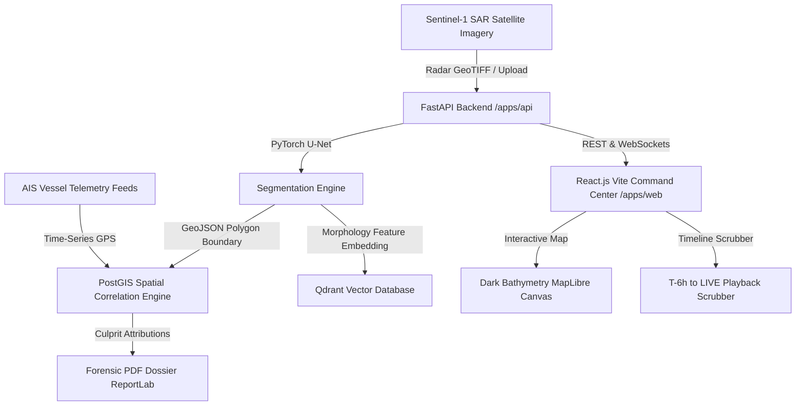

# OceanGuard (SIH Problem Statement SIH26143)
### Satellite Synthetic Aperture Radar (SAR) Oil Spill Detection & AIS Vessel Tracking System

[](https://github.com/)
[](https://github.com/)
[](https://github.com/)

---

## 🌊 Overview
**OceanGuard** is an automated, satellite-based maritime environmental surveillance and forensic incident attribution platform. It combines:
1. **Sentinel-1 SAR C-Band Radar Computer Vision**: PyTorch lightweight U-Net CNN for dark-spot oil slick boundary segmentation.
2. **PostGIS Kinematic Vessel Trajectory Correlation**: Geospatial `ST_DWithin` trajectory back-projection ($T-6\text{h}$) to attribute culprit ships with statistical probability scoring ($0-100\%$).
3. **Qdrant Vector Database**: Cosine similarity search over slick morphology features (area, perimeter, eccentricity, backscatter signature) against historical discharge patterns.
4. **Court-Admissible Forensic Audit Dossier**: Automated ReportLab PDF generator containing satellite metadata, AIS time-series logs, GPS intercept coordinates, and digital legal officer certification.
5. **Dark Tactical Command Center UI**: Built with React.js 18, Vite, Tailwind CSS, and MapLibre dark bathymetry canvas with interactive time-scrubbing.

---

## 🏛️ System Architecture



---

## 🚀 Quickstart Guide

### Prerequisites
- **Node.js**: v18+ (v20+ recommended)
- **Python**: 3.10+ (Python 3.11/3.14 supported)
- **Docker & Docker Compose** (Optional for live PostGIS/Qdrant containers; standalone mock fallback runs out of the box)

---

### Step 1: Start Database & Vector DB (Docker)
```bash
# Start PostgreSQL 16 with PostGIS and Qdrant Vector DB
docker compose up -d
```
* PostGIS runs on `localhost:5432` (`oceanguard / oceanguard123 / oceanguard_db`)
* Qdrant runs on `localhost:6333`

---

### Step 2: Set Up & Run API Backend (`apps/api`)
```bash
# 1. Create and activate Python virtual environment
python -m venv .venv

# On Windows (PowerShell/CMD):
.venv\Scripts\activate
# On Linux/macOS:
source .venv/bin/activate

# 2. Install dependencies
pip install -r apps/api/requirements.txt

# 3. Seed demo dataset (5 vessels, 6-hour AIS tracks, detected slick)
python apps/api/scripts/seed_demo_data.py

# 4. Start FastAPI server
uvicorn apps.api.main:app --reload --host 0.0.0.0 --port 8000
```
* **API Documentation**: [http://localhost:8000/docs](http://localhost:8000/docs)
* **WebSocket Telemetry Stream**: `ws://localhost:8000/ws/telemetry`

---

### Step 3: Run Tactical Command Web App (`apps/web`)
```bash
cd apps/web

# Install dependencies
npm install

# Start Vite React dev server
npm run dev
```
* **Command Dashboard**: [http://localhost:3000](http://localhost:3000)

---

## 🛰️ REST API Endpoints

| Method | Endpoint | Description |
| :--- | :--- | :--- |
| `GET` | `/api/v1/health` | Diagnostic status for DB, Qdrant, PyTorch U-Net & active alerts |
| `GET` | `/api/v1/spills` | GeoJSON FeatureCollection of all detected oil slicks |
| `GET` | `/api/v1/spills/{id}` | Single incident metadata and spatial polygon |
| `GET` | `/api/v1/spills/{id}/correlate` | PostGIS spatial correlation & ranked culprit suspect vessels |
| `GET` | `/api/v1/spills/{id}/similar` | Qdrant Cosine vector similarity historical spill matches |
| `POST`| `/api/v1/spills/detect` | Uploads SAR image, runs U-Net segmentation & auto-correlates |
| `GET` | `/api/v1/reports/{id}/pdf` | Downloads court-admissible Forensic Incident Audit PDF |
| `GET` | `/api/v1/vessels` | Real-time vessel fleet positions and transit details |
| `WS`  | `/ws/telemetry` | WebSocket stream broadcasting real-time vessel position updates |

---

## 🎯 Key Demonstration Scenarios

### Scenario A: Illegal Nighttime Tanker Discharge (Arabian Sea • Mumbai High)
- **Incident**: `INC-IND-2024-01` (5.40 sq km hydrocarbon slick detected in Sentinel-1 C-Band).
- **Culprit**: `MT DESH SHANTI` (MMSI: 419000123, VLCC Crude Tanker, 333m, Indian Flag).
- **Attribution Confidence**: **98.4%** (Direct centroid intercept at 22:45 UTC, distance < 110m).
- **Qdrant Vector Match**: Morphological similarity match to Mumbai High Offshore Platform Sheen (99.8% match).

### Scenario B: Bay of Bengal (Chennai-Ennore Corridor)
- **Incident**: `INC-IND-2024-02` (2.80 sq km bunker sheen detected along the Coromandel Coast).

---

## 📄 Forensic Evidence PDF Sample
Generated instantly via `/api/v1/reports/{spill_id}/pdf` using ReportLab:
- Maritime Authority Security Seal (OMEGA-7 Classification)
- Satellite SAR Acquisition Parameters
- Suspect Vessel MMSI, Call Sign, Flag & Dimensions
- High-Precision AIS Intercept Coordinate Logs
- Digital Officer Signature Verification Block
